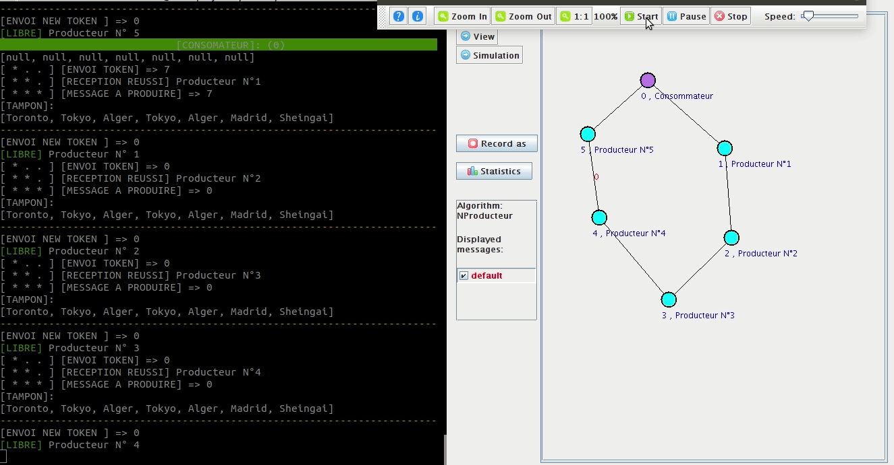

# VisidiaAlgo
*Algorithm created by ( Sid ahmed brahimi @sidou01 & Salah Benayeb @halasproject )*

## Visidia Description
ViSiDiA is a tool for implementing, simulating, testing and visualizing distributed algorithms. It is motivated by the important theoretical results on the use of graph relabelling systems to encode distributed algorithms and to prove their corretness.

The high level encoding of distributed algorithms in form of rewriting systems allows a better description and presentation of these algorithms. The result is a formal approach to decribe and study distributed algorithms in a unified and simple way.

ViSiDiA provides a library together with an easy interface to implement distributed algorithms described by means of local computations.

This tool can be used to visualize and experiment distributed algorithms, and therefore helps in their design and their validation.

Several distributed algorithms have been already implemented and can be directly animated

## Algorithm

The problem of producers and consumers is a computer example of resource synchronization, which can be envisaged in different contexts of concurrent programming, in particular in a multi-threaded environment. It involves sharing between (n) producer and (1) consumer, tokens used as a queue. The producer generates a data element, puts it on the queue and starts again; simultaneously, the consumer removes the data from the queue.
